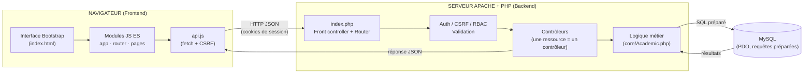
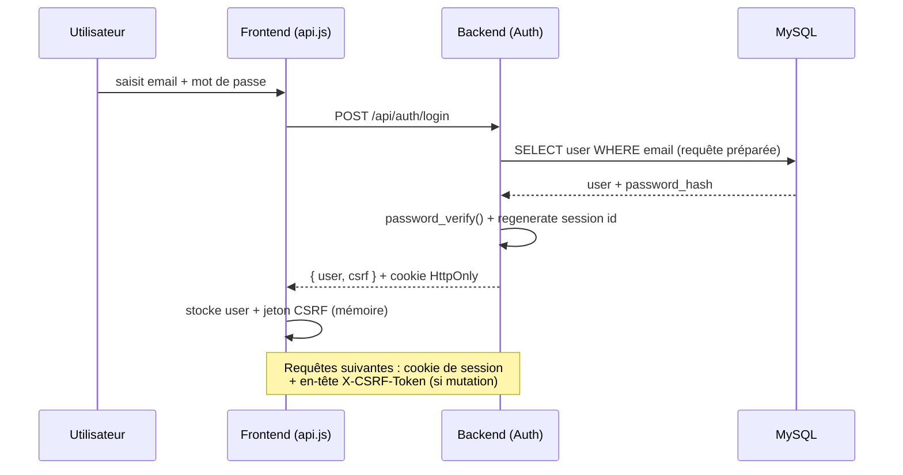

# Architecture du système — SmartCampus

## 1. Vue d'ensemble (client–serveur)

SmartCampus suit une architecture **client–serveur** à séparation nette
**frontend / backend**, communiquant par une **API REST** en JSON.



## 2. Cycle de vie d'une requête

1. Le frontend (module de page) appelle `api.get/post/...` dans `api.js`.
2. `api.js` ajoute l'en-tête `X-CSRF-Token` (pour les requêtes mutantes) et envoie le
   cookie de session (`credentials: 'same-origin'`).
3. Apache réécrit l'URL `/api/<route>` vers `api/index.php` (via `.htaccess`).
4. `index.php` démarre la session, instancie le `Router` et **dispatche** vers le
   contrôleur correspondant à la route.
5. Le contrôleur applique les **gardes** (`Auth::requireRole`, `Auth::verifyCsrf`),
   **valide** les entrées (`Validator`), exécute la **logique métier** et accède à la
   base via **PDO** (requêtes préparées).
6. La réponse est renvoyée en **JSON** normalisé (`Response::json` / `Response::error`).
7. Le frontend met à jour le DOM (rendu de la page).

## 3. Organisation du backend (MVC léger, sans framework)

```
api/
├── index.php              # Front controller : autoload + table des routes + dispatch
├── config/
│   ├── config.php          # Constantes (+ surcharge config.local.php non versionnée)
│   └── Database.php        # Connexion PDO (Singleton)
├── core/
│   ├── Router.php          # Routage REST (motifs {param})
│   ├── Request.php         # Méthode, segments d'URL, corps JSON
│   ├── Response.php        # Réponses JSON normalisées
│   ├── Auth.php            # Sessions, login, CSRF, RBAC
│   ├── Validator.php       # Validation des entrées (chaînable)
│   ├── Academic.php        # Règles métier réutilisables (moyennes, prérequis, conflits)
│   └── Controller.php      # Classe de base (accès PDO, notifications)
└── controllers/            # Auth, User, Student, Teacher, Course, Enrollment,
                            # Grade, Schedule, Message, Notification, Dashboard, Stats, Pdf
```

**Pourquoi pas de framework (Laravel/Symfony) ?** Le sujet déconseille les générateurs
produisant l'essentiel de l'architecture et valorise une démarche de conception maîtrisée.
Un mini-noyau maison (≈ 6 classes) rend chaque mécanisme (routage, auth, validation)
**explicable en soutenance**, tout en gardant une structure proche d'un vrai framework MVC.

## 4. Organisation du frontend (SPA modulaire)

- **Une seule page** (`index.html`) ; le contenu est rendu dynamiquement → pas de
  juxtaposition de pages statiques (exigence du sujet).
- **Routeur par hash** (`router.js`) avec contrôle d'accès par rôle et **chargement
  dynamique** des modules de page (`import()` à la demande).
- **Séparation des responsabilités** : `api.js` (réseau), `store.js` (état),
  `ui.js` (composants : toasts, modales, échappement HTML), `auth.js` (session),
  `pages/*.js` (une vue = un module).

## 5. Flux d'authentification & sécurité



Couches de sécurité : voir `README.md` §6 et `RAPPORT-compromis-techniques.md`.
