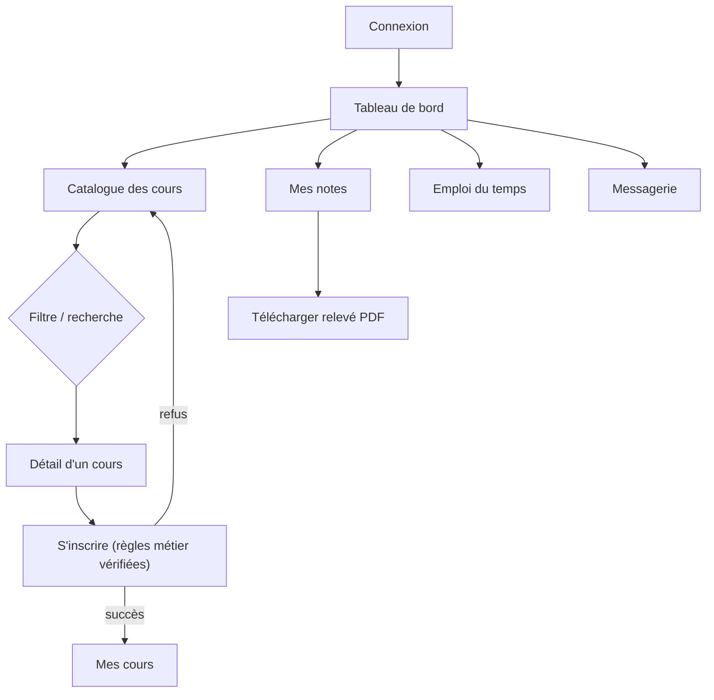
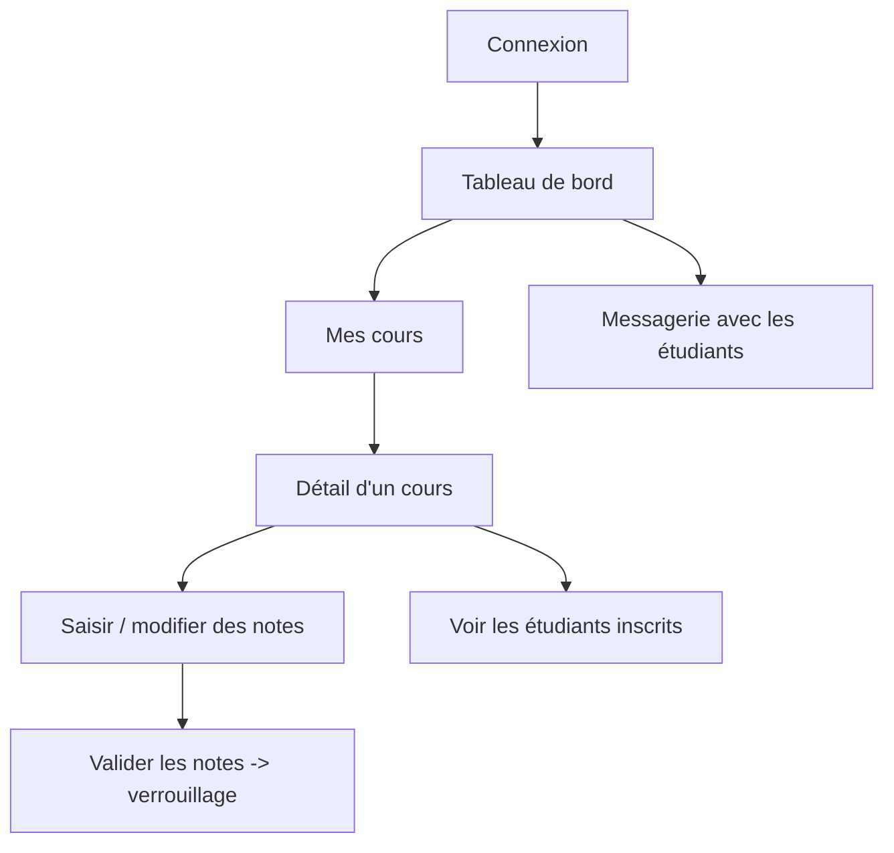
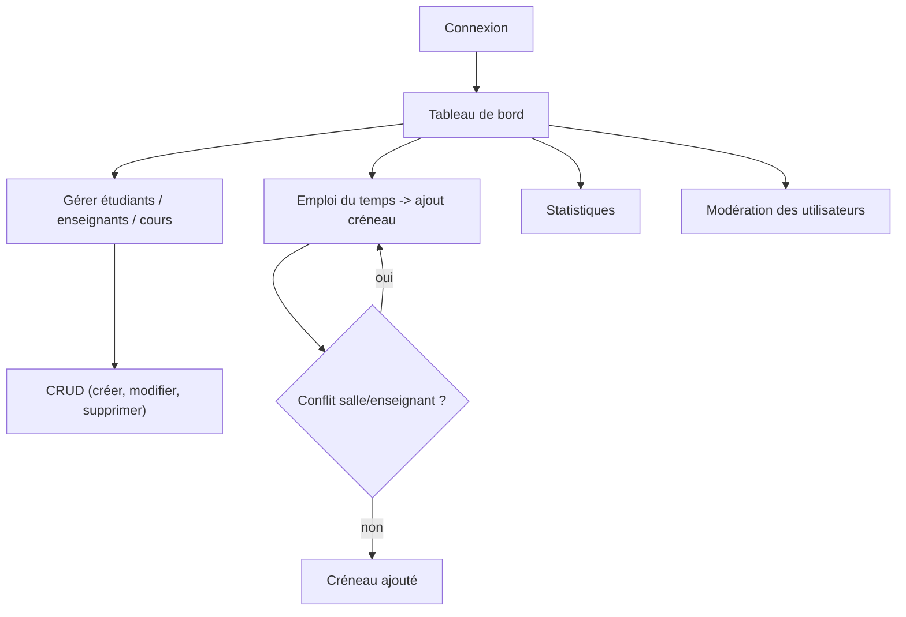

# Wireframes & Storyboard — SmartCampus

> Les maquettes ci-dessous décrivent l'organisation des écrans. Des **captures de
> l'application réelle** sont disponibles dans `docs/screenshots/` (générées
> automatiquement) et illustrent fidèlement ces wireframes.

## 1. Gabarit général (layout)

```
+--------------------------------------------------------------+
|  [≡] SmartCampus              🔔(3)   👤 Nom utilisateur ▾    |  <- barre supérieure
+-------------+------------------------------------------------+
|  SIDEBAR    |   CONTENU DE LA PAGE                           |
|  (par rôle) |   +------------------------------------------+ |
|  • Tableau  |   |  Titre de page          [actions]        | |
|  • Cours    |   +------------------------------------------+ |
|  • Notes    |   |  Filtres / Tableau / Cartes / Formulaire | |
|  • ...      |   |                                          | |
+-------------+------------------------------------------------+
```
Le menu latéral s'adapte au rôle (admin / enseignant / étudiant) et se replie en
dessous du point de rupture mobile (≡).

## 2. Wireframe — Connexion / Inscription

```
            +-------------------------------+
            |        🎓  SmartCampus        |
            |   [ Connexion | Inscription ] |
            |  E-mail    [________________] |
            |  Mot passe [________________] |
            |        [  Se connecter  ]     |
            |  Comptes démo : admin@... etc |
            +-------------------------------+
```
*(Capture : `screenshots/` — écran d'accueil dégradé bleu, carte centrale.)*

## 3. Wireframe — Tableau de bord (étudiant)

```
Bonjour Emma 👋
+----------+----------+----------+-----------+
| 3 Cours  | 16.3/20  | 9 ECTS   | 2 Notifs  |   <- cartes statistiques
+----------+----------+----------+-----------+
+------------------------+  +----------------------+
| Prochaines séances     |  | Notes récentes       |
| Lun 08:00 INFO-201 B201|  | INFO-201 CC1   15.5  |
| ...                    |  | ...                  |
+------------------------+  +----------------------+
```
*(Capture : `student-dashboard.png`.)*

## 4. Wireframe — Catalogue des cours (cartes filtrables)

```
[Recherche____] [Niveau ▾] [Semestre ▾] [Département__] [Trier ▾]
+-----------------+ +-----------------+ +-----------------+
| INFO-201   L2/S3| | INFO-203   L2/S3| | MATH-202   L2/S3|
| Algorithmique   | | Bases de données| | Maths ingénieur |
| 👤 M. Ali       | | 👤 S. Hamdi     | | 👤 L. Bensalem  |
| 👥 2/3   ECTS 5 | | 👥 3/30  ECTS 4 | | 👥 5/30  ECTS 4 |
| [Détails][S'ins.]| | [Détails][S'ins.]| | [Détails][S'ins.]|
+-----------------+ +-----------------+ +-----------------+
```
*(Captures : `admin-courses.png`, `student-catalogue.png`.)*

## 5. Wireframe — Détail d'un cours (grille de notes, enseignant)

```
INFO-201 — Algorithmique avancée                       [Retour]
+-------------------------------+  +----------------------+
| Description, ECTS, enseignant |  | Créneaux             |
+-------------------------------+  +----------------------+
Notes des étudiants inscrits      [Inscrire étudiant][Valider notes]
+----------+-----+-----+----+-------+-------+---------+---------+
| Étudiant | CC1 | CC2 | DS |Projet |Examen |Moyenne  |Résultat |
| Martin   |15.5🔒|14.0🔒| +  | +     |16.0   |15.38    | Admis   |
| Dubois   |11.0 |12.5 | +  | +     | +     |11.75    | Admis   |
+----------+-----+-----+----+-------+-------+---------+---------+
(clic sur une cellule = saisir/modifier ; 🔒 = note verrouillée)
```
*(Capture : `teacher-course-grades.png`.)*

## 6. Wireframe — Emploi du temps (hebdomadaire)

```
+--------+--------+--------+--------+--------+
| LUNDI  | MARDI  |MERCREDI| JEUDI  |VENDREDI|
+--------+--------+--------+--------+--------+
|INFO-201|MATH-202|INFO-301|MATH-301|INFO-501|
|08-10   |08-10   |08-10   |08-10   |14-17   |
|B201    |B201    |Lab1    |B105    |Lab2    |
|INFO-203|PHYS-202|INFO-305|        |        |
|10-12   |10-12   |10-12   |        |        |
+--------+--------+--------+--------+--------+
```
*(Captures : `admin-schedule.png`, `student-schedule.png`.)*

## 7. Storyboard — Parcours utilisateurs

### 7.1 Parcours étudiant


### 7.2 Parcours enseignant


### 7.3 Parcours administrateur


## 8. Choix ergonomiques

- **Cohérence** : même gabarit (sidebar + contenu) pour tous les rôles, seules les
  entrées de menu et les actions changent.
- **Feedback immédiat** : toasts de confirmation, messages d'erreur des règles métier
  affichés tels quels (ex. « Ce cours est complet »).
- **Responsive** : grille Bootstrap, sidebar repliable, tableaux scrollables sur mobile.
- **Accessibilité** : contrastes, labels de formulaires, icônes accompagnées de texte.
